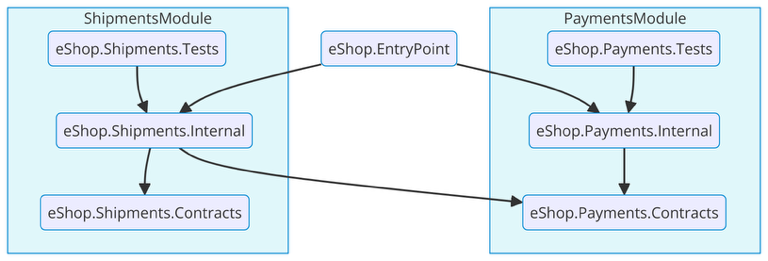

# Introducing Modulith: A Tool for Modular Monoliths

If you’ve been following software architecture trends, you know that microservices often steal the spotlight. However, for many teams, a **modular monolith** can offer a more straightforward yet still powerful approach to building large applications. But if you're tired of wrestling with complex microservices or monolithic architectures that quickly turn into a maintenance nightmare, **Modulith**--an open-source project designed to streamline the development of modular monoliths--is here to change the game.

## What’s a Modular Monolith and Why Should You Care?

A modular monolith is a single application divided into distinct, well-defined modules, each encapsulating a specific functional area of the application. This structure makes the codebase easier to understand, maintain, and test. Unlike a tightly coupled "Big Ball of Mud" monolith, a modular monolith offers clear boundaries and separation of concerns without the overhead of managing distributed systems like microservices.

While microservices achieve boundaries through physical separation, a modular monolith avoids operational overhead by using a single solution for all modules. As Ardalis teaches in his [Modular Monoliths course](https://dometrain.com/bundle/from-zero-to-hero-modular-monoliths-in-dotnet/), you can use .NET projects and C# access modifiers to separate a module’s public interface (Contracts) from its internal types. This ensures that other modules can only reference the public interface of a module.

### A Practical Example

Imagine you’re developing an e-commerce application called eShop. Initially, it starts as a single project, but as you add more features, it could become a tangled web of dependencies—a classic "Big Ball of Mud." To avoid this, you decide to transform eShop into a modular monolith, starting with the Payments and Shipments modules.

First, we create a separate project for the Payments module internals and declare all its types as `internal`. This way, other modules will not be able to reference the module's internal types.

Then, we create a `Contracts` project to define the public interface so that other modules can depend on our `Contracts` module and not be concerned with our internal project. This ensures that references between modules are only introduced through well-defined, public interfaces, enforcing clear boundaries and eliminating the risk of unwanted dependencies.

We can also extend modularity to our tests by introducing a single test project per module. This way, we can organize our tests to target a specific module and end up with the following solution structure:

```
eShop/
    ├── eShop.EntryPoint <-- Original Project (Contains the program.cs, appsettings, etc.)
    └── eShop.PaymentsModule
        ├── eShop.Payments.Internal
        ├── eShop.Payments.Contracts
        ├── eShop.Payments.Tests
```

The next step is to set the appropriate project dependencies.

- The `Entry` project should reference the `Internal` project of every module to ensure endpoints and services are properly registered in the application builder.

- The `Internal` project should also reference the `Contracts` project so that other modules can depend on the types it exposes.

- The `Test` project should depend on the `Internal` project it's meant to test.

- If another module, like `Shipments`, needs to communicate with the `Payments` module, it would reference the `eShop.Payments.Contracts` project.

Adding these references and supposing we have that second `Payments` module will lead to a solution like this:



Now, we’ve set the path for eShop to become a maintainable and scalable application, all within a single solution and repository. If you want to learn more about this and other useful patterns when building Modular Monoliths check out [Ardalis' course](https://dometrain.com/bundle/from-zero-to-hero-modular-monoliths-in-dotnet/). However, creating three projects per module manually is time-consuming and can discourage team members from adding new modules. How can we make this process faster and repeatable for everyone working on eShop?

## Enter Modulith

Developed in conjunction with [Ardalis](https://github.com/ardalis), Modulith automates much of the setup you’d typically have to do manually when building modular monoliths.

With Modulith, you can add a new module to your project with a single command. It takes care of creating the necessary projects, adding the correct dependencies, and registering services for you. This allows you to focus on what really matters: building features. This is especially useful when working in a team. Modulith provides an easy way to set up new modules without worrying about the repetitive tasks involved in setting them up.

You can install Modulith by running:

```bash
dotnet new install Ardalis.Modulith
```

Creating a new modular solution is as simple as running:

```bash
dotnet new modulith -n eShop --with-module Payments
```

This creates a solution, **eShop**, with a single module, **Payments**. Then you can add new modules by running:

```bash
cd eShop # Change directory into the solution folder

dotnet new modulith --add basic-module --with-name Shipments --to eShop
```

That's it! Now you have a solution with two modules. Then, you can add new modules by running the last command and changing the `--with-name` parameter to the name of your new module. But what exactly was created?

Glad you asked. These three commands created eight projects and added the correct references between them. The resulting solution structure looks like this:

```
eShop/
    ├── eShop <-- Entrypoint
    ├── eShop.Shared
    ├── Payments
    |   ├── eShop.Payments <- Internal project
    |   ├── eShop.Payments.Contracts
    |   ├── eShop.Payments.Tests
    ├── Shipments
        ├── eShop.Shipments <- Internal project
        ├── eShop.Shipments.Contracts
        ├── eShop.Shipments.Tests
```

### Stay Tuned for More

**Modulith** is not stopping at creating entire modules. A second set of features will focus on **item templates**. These templates don’t create whole modules but instead add a set of classes to help you implement specific patterns within your modules. For instance, one such item template could generate a set of CRUD endpoints and a repository for a new domain entity. Another template might create the classes needed for a materialized view for inter-module communication. While you’ll still need to tailor the generated code to your specific needs, the initial creation of classes will be incredibly fast and consistent, reducing repetitive tasks and encouraging team members to reuse known patterns.

Ready for more? Head over to the [Modulith GitHub repository](https://github.com/ardalis/modulith) to get started. Your feedback is invaluable—whether you’re contributing a new module, reporting a bug, or sharing your success story.

This is just the beginning. In our upcoming posts, we’ll dive deeper into advanced features of Modulith, including custom templates for UI, Domain-Driven Design, and item templates.
